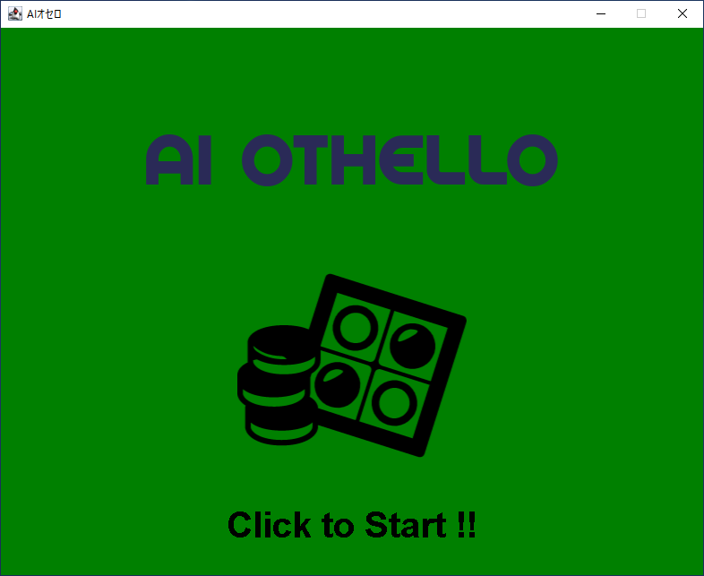
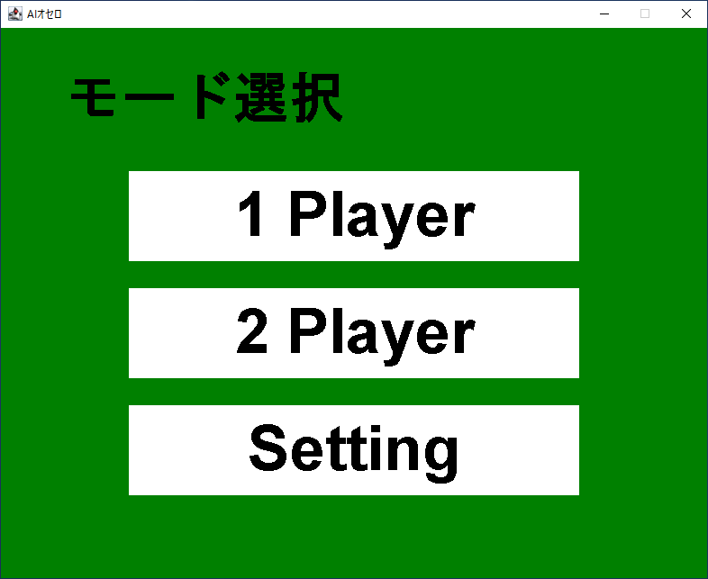
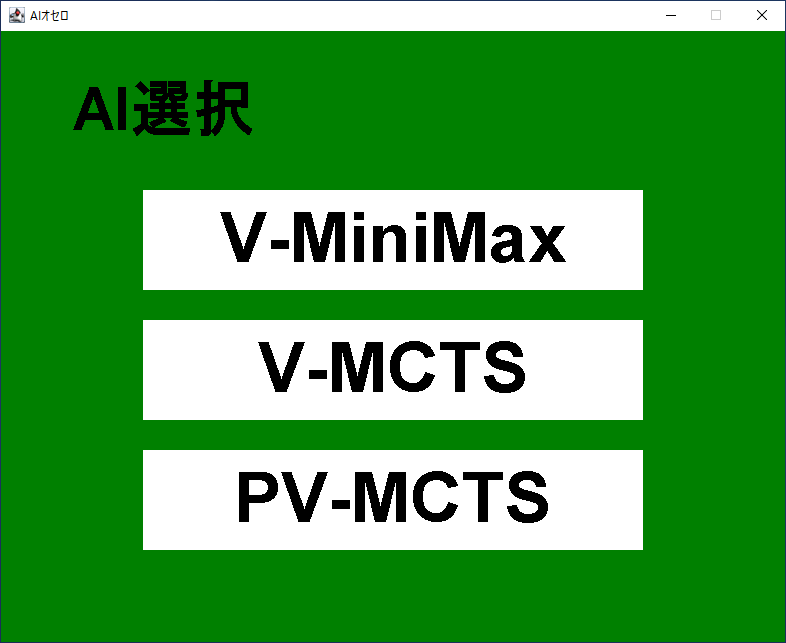
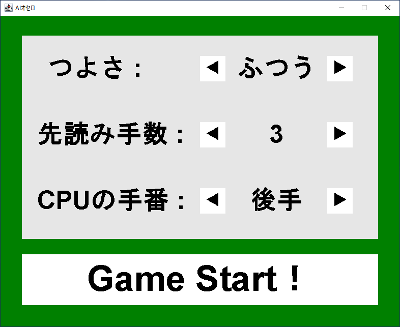
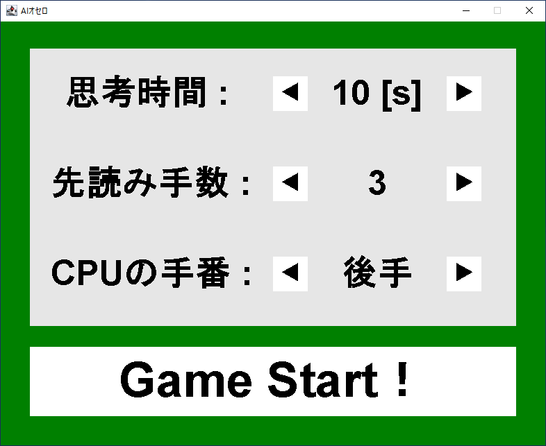
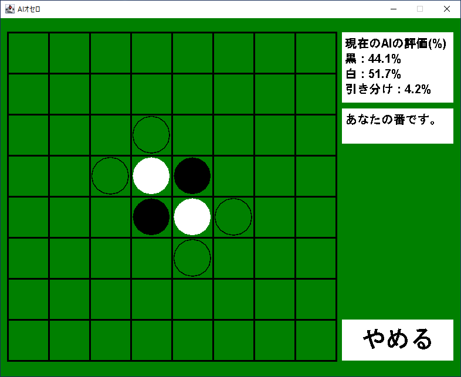

JavaOthello
====

An implementation of Reversi/Othello written in Java using marvin.

The AI was created by loading a model from the Tensorflow Functional API with dl4j.

Also, it is created by reinforcement learning through self-competition.

## Demo

###Title

###Mode Select

###AI Select

###Advanced Setting

###Play Game

## Requirement

- Java version 16 or later
